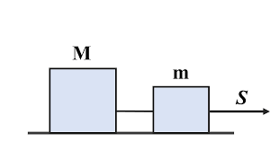
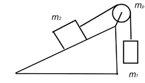
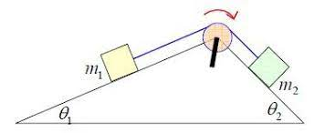
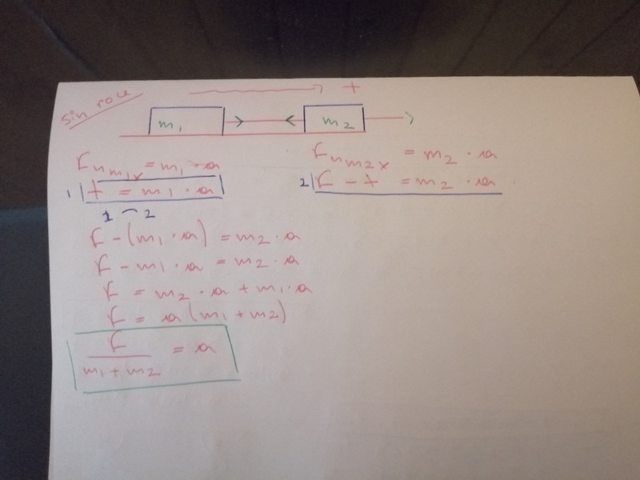

sistemas de dos masas (horizontal y vertical)

este trabajo fue realizado con la imagen de que cualquier persona con la minima informacion posible, fuera capaz de
encontrar la aceleracion y la tension en un sistema fisico imaginario.
Y por ello decidimos que la mejor opcion era crear una calculadora con una interfaz grafica amigable e intuitiva 
que pudiera saciar las consultas de un usuario

Para comenzar buscamos los distintos sistemas fisicos con los que va a operar nuestra calculadora.
Seleccionamos los tres casos más usuales: 
1- dos masas en un sistema horizontal: 

2- dos masas en un plano inclinado con 1 angulo:
  
  
3- dos masas en un plano inclinado con 2 angulos:
 

El primer caso es facil de reconocer ya que siempre que empujemos un objeto con la intencion de moverlo se estaria 
bajo un modelo de sistema horizontal.
el modelaje y la matematica usada para encontrar la aceleracion y la tension seran explicados más en detalle en un
video que se encontrara en la parte final del documento

el segundo caso

el tercer caso

Luego de terminar el modelaje de los 3 sistemas solo restava programar la calculadora magica.
Para ello tuvimos que instalar tkinter para asi crear toda la interfaz con la que interactua el usuario,
la instalacion fue facil solo pusimos en la terminal la siguente linea " pip install tk " y se descaga de manera automatica,
tambien utilizamos la libreria "math" para facilitar los calculos, esta no fue necesaria de descargar porque viene incluida
en la descarga de "pyhton".

Para la correcta utilizacion de "tkinter" usamos 3 videos que nos proporcionaron todas las herramientas
para lograr esta calculadora: 

link_1: https://youtu.be/q17aL3AdOYg
link_2: https://youtu.be/HndNFnBNwY4
link_3: https://youtu.be/hGqJetmxRg0

Y para el uso de la libreria "math" solo necesitabamos una pequeña parte de todo lo que almacena, por lo que reurrimos a una
pagina para poder seleccionar la funcion más optima para lo que queriamos lograr
link_pagina: https://interactivechaos.com/es/manual/tutorial-de-python/la-libreria-math

Y para ir finalizando, queremos dejar algunas de nuestras impresiones.
1- el trabajo no fue tan facil como aparentaba, en más de una ocasion casi nos volvemos locos tratando de encontrar
una solucion a los problemas que iban surguiendo, para que finalmente terminara siendo un simple problema de sintaxis.
2-pero lo más dificil sin dudas fue el trabajo en equipo, en más de una ocasion yo pensaba que estaba trabajando 
en algo que faltaba, a ultimo momento cuando ya estaba listo para subirlo me encontraba con la sorpresa de que ya estaba 
listo y que un compañero de trabajo habia sido más rapidp que yo.

"video explicativo"
